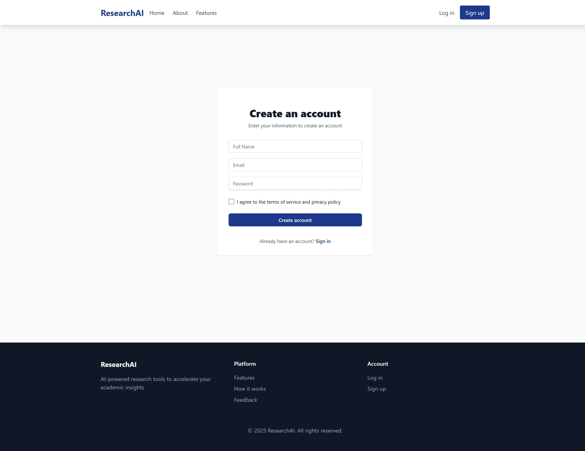
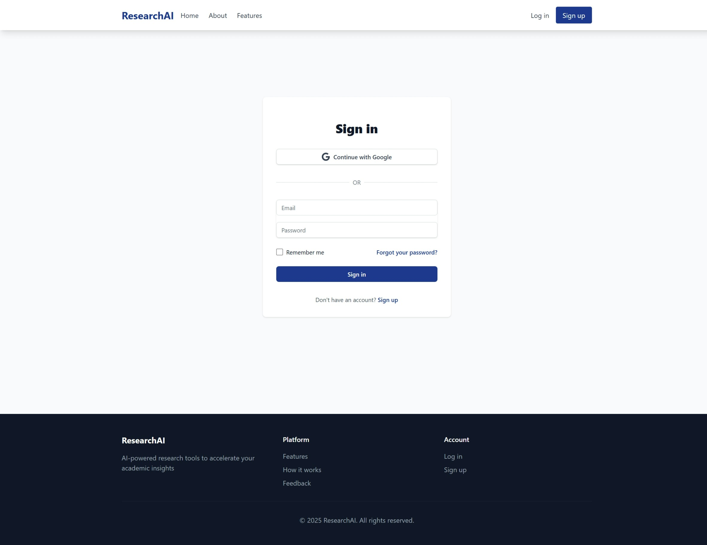

# Research-AI

Research-AI is a full-stack, backend-first research assistant:

- FastAPI backend with cookie-based auth, chat/session APIs, and a LangChain/LangGraph research runtime.
- React + Vite frontend that acts as a thin UI client over backend APIs.
- Firestore for users, chat metadata, message history, vector data, and feedback.

## What It Does

- Supports normal chat and deep research workflows in the same interface.
- Uses web search, URL scraping, and vector retrieval tools.
- Can hand off from chat agent to a dedicated multi-step research graph.
- Stores sessions, supports rename/share/delete, and keeps chats ordered by recent activity.
- Supports `/research` command flow from frontend and backend orchestration.

## Benchmark Results

Research-AI was evaluated on the [DeepResearch Bench](https://github.com/Ayanami0730/deep_research_bench) benchmark with the following results:

- Comprehensiveness: `0.5595`
- Insight: `0.5930`
- Instruction Following: `0.5208`
- Readability: `0.5253`
- Overall Score: `0.5532`

With these results, Research-AI is at the **1st position on the leaderboard of DeepResearch Bench**.

### Leaderboard Comparison Graphs

#### Overall Score Comparison


#### Parameter-wise Comparison


## Current Architecture

### Backend (`backend/`)

- `main.py`: app bootstrap, shared state initialization, CORS, router registration.
- `api/routes/auth.py`: signup/login/logout/me + Google OAuth start/callback.
- `api/routes/chat.py`: chat, session list/history, rename/delete/share.
- `api/routes/feedback.py`: authenticated feedback submission.
- `api/session.py`: signed JWT cookie creation/validation (`HttpOnly` cookies).
- `auth_service.py`: Firebase Identity Toolkit integration + Google OAuth token exchange.
- `agent.py`: LangChain `create_agent(...)` chat runtime with middleware.
- `graph.py`: LangGraph research pipeline for outline -> perspectives -> content -> final doc.
- `tools.py`: web/url/vector tools with async timeout/cancellation behavior.
- `scrape.py`: Playwright + BeautifulSoup scraper with shared browser context.
- `database.py`: Firestore chat history, vector store, user/session/feedback persistence.
- `structures.py`: Pydantic schemas for outline, perspectives, content sections, final doc.
- `nodes.py`: prompt/system-message builders.

### Frontend (`frontend/`)

- `src/context/AuthContext.jsx`: backend auth state via `/auth/me`, cookie-based.
- `src/context/useAuth.js`: shared auth hook for consuming context.
- `src/lib/api.js`: centralized `fetch` with cookie auth, timeout, and abort support.
- `src/components/Chat/ChatInterface.jsx`: chat composition/orchestration shell.
- `src/components/Chat/hooks/*`: session loading, composer state, and research task polling.
- `src/components/Chat/components/*`: split UI modules (layout, message list, modal views, sidebar).
- `src/components/Chat/ChatHistory.jsx`: sidebar sessions + share/rename/delete actions.
- `src/components/Auth/*`: email/password and Google login/signup screens.
- `src/components/Feedback.jsx`: authenticated feedback form.

## Frontend Screenshots

### Landing Page


### Signup Page



### Login Page



### New Chat Page


### Previous Chat Page


### Feedback Page


### Data Stores

Firestore collections used by backend:

- `users/{uid}`
- `user_chats/{uid}` with `sessions` map metadata
- `chats/{session_id}` (LangChain `FirestoreChatMessageHistory`)
- `vector/*` (LangChain Firestore vector store docs with `metadata.session_id`)
- `feedback/*`

### Research Graph Diagram


## Runtime Behavior

### Chat Agent

The chat agent in `backend/agent.py` is built with `langchain.agents.create_agent(...)` and middleware:

- `ChatHistoryMiddleware`: injects recent history into model context.
- `ResearchCommandMiddleware`: handles forced research handoff and missing-topic follow-up behavior.
- `UnknownToolFallbackMiddleware`: returns a retry tool message for invalid tool calls.
- `PersistMessagesMiddleware`: persists non-human messages to Firestore.

History policy:

- Keeps latest 5 user turns (plus associated AI/tool messages).
- Summarizes older history and prepends that summary into context.

### Deep Research Graph

`backend/graph.py` executes:

1. `generate_document_outline`
2. `generate_perspectives`
3. `generate_content_for_perspectives` (parallel expert pipelines)
4. `final_section_generation`

Controls applied in graph:

- `research_breadth`
  - `low`: 1 expert, no final synthesis pass (expert output becomes final content)
  - `medium`: 3 experts
  - `high`: 5 experts
- `document_length`: mapped to OpenAI `verbosity` (`low|medium|high`)
- `model` tier:
  - `mini`: `gpt-5-nano` + Gemini Flash variants
  - `pro`: `gpt-5-mini` + Gemini Flash variants

### Tooling Behavior

`backend/tools.py`:

- `web_search_tool`
  - Gets up to 5 URLs via Google Custom Search
  - Per-URL scrape timeout: 20s
  - Overall scrape phase timeout: 20s
  - Tool total timeout: 30s
  - Stops early once minimum docs reached:
    - `research_depth=low`: 1
    - `research_depth=high`: 3
- `url_search_tool`: scrape single URL and store chunks.
- `vector_search_tool`: session-filtered vector retrieval from Firestore.

## `/research` Command Flow

Frontend:

- Typing `/` opens autocomplete with `/research`.
- Empty `/research` is blocked client-side.
- Sends `force_research: true` when `/research ...` is used.

Backend:

- Parses `/research` in `/chat`.
- Builds handoff context from conversation history.
- Forces handoff tool call to research graph when topic/context is available.
- If user sends `/research` with no context, asks for topic and sets a pending flag.
- Next user message in that session can resume and trigger research handoff.

## API Summary

### Auth

- `POST /auth/signup`
- `POST /auth/login`
- `POST /auth/logout`
- `GET /auth/me`
- `GET /auth/google/start`
- `GET /auth/google/callback`

### Chat & Sessions

- `POST /chat`
- `GET /chat/sessions`
- `GET /chat/sessions/{session_id}/messages`
- `PATCH /chat/sessions/{session_id}`
- `DELETE /chat/sessions/{session_id}`
- `POST /chat/sessions/{session_id}/share`

### Feedback

- `POST /feedback`

### System

- `GET /`

## Local Development

### Prerequisites

- Python 3.13 recommended
- Node.js 18+ recommended
- Firestore project + service account
- Firebase Auth project configuration

### 1) Backend

```bash
cd backend
python -m venv .venv
.venv\Scripts\activate
pip install -r requirements.txt
python -m playwright install chromium --only-shell --with-deps
uvicorn main:app --host 127.0.0.1 --port 8000 --reload
```

### 2) Frontend

```bash
cd frontend
npm install
npm run dev
```

Frontend expects backend at `VITE_API_BASE_URL` and uses cookie auth (`credentials: include`).

Production deployment guardrails:

- `VITE_API_BASE_URL` must point to your deployed backend origin.
- Backend `CORS_ORIGINS` must include the exact frontend origin.
- For cross-site frontend/backend hosting, backend cookies must use:
  - `COOKIE_SECURE=true`
  - `COOKIE_SAMESITE=none`

## Firestore Vector Index

Vector search needs a Firestore composite vector index.

Reference command is kept in `backend/index.yaml`.

Bash example:

```bash
gcloud firestore indexes composite create \
  --project=<your-project-id> \
  --collection-group=vector \
  --query-scope=COLLECTION \
  --field-config=field-path=metadata.session_id,order=ASCENDING \
  --field-config='field-path=embedding,vector-config={"dimension":"768","flat":"{}"}' \
  --database='(default)'
```

PowerShell line continuation uses backtick (`` ` ``), not backslash.

## Docker / Cloud Run Notes

Current backend `Dockerfile`:

- Uses `python:3.13-slim-bookworm`
- Installs from pinned `requirements.txt` with `--no-deps`
- Installs Playwright browser via:
  - `python -m playwright install --with-deps chromium --only-shell`

For cross-site frontend/backend deployments (for example Vercel + Cloud Run):

- Use `COOKIE_SECURE=true`
- Use `COOKIE_SAMESITE=none`
- Set `CORS_ORIGINS` to exact frontend origin(s)
- Set `GOOGLE_OAUTH_REDIRECT_URI` to exact backend callback URL:
  - `https://<backend-domain>/auth/google/callback`

## Project Layout

```text
.
|- backend/
|  |- api/
|  |  |- routes/
|  |  |- models.py
|  |  |- session.py
|  |  `- utils.py
|  |- agent.py
|  |- auth_service.py
|  |- custom_search.py
|  |- database.py
|  |- graph.py
|  |- main.py
|  |- nodes.py
|  |- scrape.py
|  |- structures.py
|  `- tools.py
|- frontend/
|  |- src/
|  |  |- components/
|  |  |- context/
|  |  `- lib/
|  `- vite.config.js
`- LICENSE
`- README.md
```
