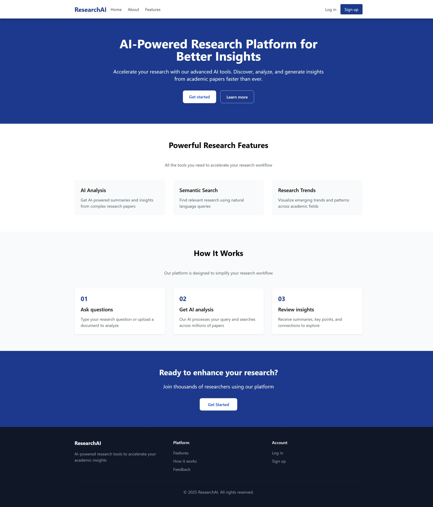
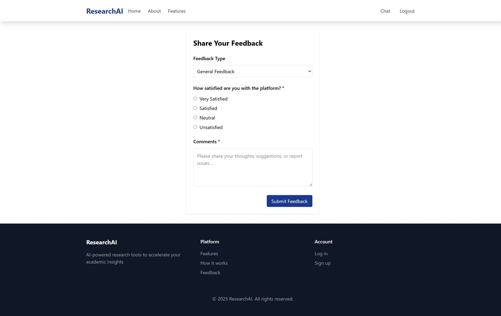

# Research-AI

Research-AI is a full-stack AI based research assistant:

- **FastAPI backend** with cookie-based auth, chat/session APIs, a LangChain agent runtime, and a LangGraph multi-step research pipeline.
- **React + Vite frontend** that renders rich responses including Mermaid diagrams, ECharts visualizations, and KaTeX equations.
- **Firestore** for users, chat metadata, message history, vector data, jobs, and feedback.

## What It Does

- Supports normal chat and deep research workflows in the same interface.
- Uses web search (Google Custom Search API), URL scraping (Playwright + BeautifulSoup), and vector retrieval tools.
- Hands off from the chat agent to a dedicated multi-step LangGraph research pipeline, either via `/research` command, LLM-classified auto-handoff, or explicit research request.
- Research runs **asynchronously in the background** — the frontend polls for progress updates and displays live node-level status while the pipeline executes.
- Enqueues and processes **PDF URLs in the background** — fetches, extracts, chunks, and stores PDF content as session-scoped vector documents.
- Validates, repairs, and renders **Mermaid diagrams**, **ECharts charts**, and **KaTeX equations** in every research response through a two-tier validation + LLM repair pipeline.
- Stores sessions, supports rename/share/delete, and keeps chats ordered by recent activity.

## Benchmark Results

Research-AI was evaluated on the [DeepResearch Bench](https://github.com/Ayanami0730/deep_research_bench) benchmark with the following results:

- Comprehensiveness: `0.5595`
- Insight: `0.5930`
- Instruction Following: `0.5208`
- Readability: `0.5253`
- Overall Score: `0.5532`

With these results, Research-AI is at the **1st position on the leaderboard of DeepResearch Bench**.

### Leaderboard Comparison Graphs

#### Overall Score Comparison


#### Parameter-wise Comparison


## Current Architecture

### Backend (`backend/`)

#### Entry point & infrastructure

| File | Purpose |
|---|---|
| `main.py` | App bootstrap, lifespan management (starts/stops browser, workers, DB connection), CORS, `x-request-id` middleware, global error handlers, router registration. |
| `settings.py` | Frozen `Settings` dataclass loaded from environment variables via `get_settings()` (cached). Covers cookies, auth, models, scraping, visualization validation, PDF processing, and all timeouts. |
| `browser_lifecycle.py` | `BrowserLifecycleManager` — owns the single Playwright Chromium process; auto-relaunches on disconnect. `ManagedBrowser` provides per-call context isolation. |
| `custom_search.py` | `CustomSearch` — async Google Custom Search API client with a shared `httpx.AsyncClient`. |
| `auth_service.py` | `FirebaseAuthService` — Firebase Identity Toolkit integration + Google OAuth token exchange. |
| `database.py` | `Database` — top-level Firestore client, assembled via mixins from `database_modules/`. |

#### Database modules (`database_modules/`)

| Module | Purpose |
|---|---|
| `common.py` | Firestore client init, connection teardown. |
| `sessions.py` | Session CRUD, recent-activity ordering, share tokens. |
| `messages.py` | LangChain `FirestoreChatMessageHistory` integration, user-session access checks. |
| `vector.py` | Session-scoped vector store (LangChain Firestore + embedding model); chunk split/upsert/query. |
| `jobs.py` | Job queue for research and PDF background work (enqueue, claim, complete, fail, retry logic). Uses UUIDv7 for time-ordered job IDs. |
| `feedback.py` | Authenticated feedback persistence. |

#### Agent runtime

| File | Purpose |
|---|---|
| `agent.py` | `build_agent()` — LangChain `create_agent(...)` chat runtime with the four middleware layers. `build_research_handoff_context()` composes the handoff payload from session history. |
| `agent_modules/middleware.py` | `ChatHistoryMiddleware` — injects summarised chat history. `ResearchCommandMiddleware` — handles `/research` commands and pending-research state. `UnknownToolFallbackMiddleware` — returns a retry `ToolMessage` for invalid tool calls. `PersistMessagesMiddleware` — persists non-human messages to Firestore after each turn. |
| `agent_modules/history.py` | `get_chat_history()` — retrieves last 5 user turns (+ associated AI/tool messages) and summarises older turns via the mini model. |
| `agent_modules/state.py` | `AgentExecutionState` TypedDict. |
| `agent_modules/runtime.py` | `run_agent()` — runs the agent and emits the final text response. |
| `agent_modules/helpers.py` | Message-text extraction utilities. |

#### Research graph

| File | Purpose |
|---|---|
| `graph.py` | Re-exports `ResearchGraph` and `graphSchema` from `graph_modules/`. |
| `graph_modules/schema.py` | `graphSchema` TypedDict: `research_idea`, `document_outline`, `perspectives`, `perspective_content`, `final_document`. |
| `graph_modules/runtime.py` | `ResearchGraph` — assembles the LangGraph state machine, instantiates models and tools, wires node functions, serializes/deserializes checkpoint state. |
| `graph_modules/helpers.py` | Utilities: `expert_count_for_breadth`, `message_text`, `extract_structured_response`. |
| `graph_modules/runtime_modules/node_outline.py` | Node 1: Generates the document outline using the Gemini model + web/vector tools. |
| `graph_modules/runtime_modules/node_perspectives.py` | Node 2: Generates expert perspectives from the outline. |
| `graph_modules/runtime_modules/node_perspective_content.py` | Node 3: Runs parallel expert content pipelines (one per perspective). |
| `graph_modules/runtime_modules/node_final_sections.py` | Node 4: Final synthesis pass (skipped for `research_breadth=low`). |
| `graph_modules/runtime_modules/section_generation.py` | `run_expert_pipeline()`, `generate_final_section()`, `build_low_breadth_document()`. |
| `graph_modules/runtime_modules/callbacks.py` | `emit_progress()` — writes node progress to the job document; `emit_state_checkpoint()` — serializes graph state mid-run. |
| `graph_modules/runtime_modules/state_codec.py` | `serialize_graph_state()` / `deserialize_graph_state()` — Firestore-safe serialization. `resolve_resume_node()` — checkpoint resume logic. |
| `graph_modules/runtime_modules/visual_repair.py` | LLM repair loop for invalid Mermaid/ChartJSON blocks. Validates all blocks, re-orders invalid spans back-to-front, attempts LLM repair up to `visual_repair_max_retries` times, then drops remaining invalid blocks. |
| `graph_modules/runtime_modules/equation_repair.py` | LLM repair loop for invalid KaTeX equations. Same loop structure as visual repair; falls back to inline `` `code` `` span on exhausted retries. |

#### Visualization validation (`graph_modules/visualization_modules/`)

**Tier-1 — pure Python validators (fast, synchronous):**

| Module | What it validates |
|---|---|
| `mermaid.py` | `validate_mermaid()` — checks diagram header, unsafe content (`<script`, `onerror=`), control characters, unbalanced delimiters, malformed arrows, unquoted labels with risky characters, trailing label typos. |
| `chartjson.py` | `validate_chartjson()` — checks JSON structure, top-level keys (`title`, `caption`, `option`), chain depth ≤ 64, node count ≤ 15 000, function-like strings, unsafe prototype keys, series types, axis config. |
| `equation.py` | `validate_equation()` — 16-check structural validator: empty/too-long/unsafe/macro-injection, control chars, trailing `\`, bare `%`, inline-dollar newline, nested `$$`, unbalanced `{}` (stack), `\begin`/`\end` nesting (stack), `\left`/`\right` balance, double superscript/subscript, missing required arguments, HTML-tag injection. |
| `extract.py` | `extract_visual_blocks()` — parses all ` ```mermaid ` and ` ```chartjson ` fenced blocks with span offsets. |
| `extract_equations.py` | `extract_equation_spans()` — parses all `$...$`, `$$...$$`, `\(...\)`, `\[...\]` spans with delimiter style and offsets. |
| `reporting.py` | `drop_invalid_blocks()`, `format_invalid_visual_report()`. |
| `types.py` | `VisualBlock`, `EquationSpan`, `InvalidVisualBlock`, `InvalidEquationSpan`, `SectionValidationReport`, `SectionEquationReport`, `ValidationResult`. |

**Tier-2 — Playwright browser probe (authoritative):**

| File | Purpose |
|---|---|
| `graph_modules/visual_tier2.py` | `PlaywrightVisualTier2Validator` — spins up isolated Playwright pages loaded with the real Mermaid, ECharts, and KaTeX vendor JS bundles, and actually renders each block. Mermaid: calls `mermaid.render()`; ECharts: calls `echarts.init()` + `setOption()`; KaTeX: calls `katex.renderToString()`. Returns `valid`/`invalid`/`unavailable`. Per-session concurrency limit. |

**Async validation entrypoints** (`async_validation.py`): `validate_mermaid_async`, `validate_chartjson_async`, `validate_equation_async`, `validate_section_visualizations_async` — run Tier-1 synchronously and call Tier-2 only when Tier-1 passes.

#### PDF processing (`pdf_processing_modules/`)

| Module | Purpose |
|---|---|
| `service.py` | `PdfProcessingService` — downloads a PDF URL (HEAD probe → `.pdf` suffix check → content-type check), extracts text with `pdfminer`, then runs a Gemini Flash Lite model to produce a structured summary. Stores result as chunked vector documents. |
| `worker.py` | `PdfBackgroundWorker` — polls the Firestore `pdf_processing_jobs` queue, claims jobs, runs `PdfProcessingService`, retries up to `pdf_background_max_retries` times. |
| `helpers.py` | `extract_pdf_text_from_bytes()` — in-memory `pdfminer` extraction. |
| `models.py` | `PdfProcessResult` dataclass. |

#### Research background worker

| File | Purpose |
|---|---|
| `research_worker.py` | `ResearchExecutionService.run()` — resolves job parameters, instantiates `ResearchGraph`, streams progress back to the job document. `ResearchBackgroundWorker` — polls the Firestore `research_jobs` queue (`research_background_batch_size`, `research_background_max_retries`). |
| `research_progress.py` | `progress_message_for_node()`, `normalize_research_node()` — human-readable progress strings per graph node. |

#### API routes (`api/routes/`)

| Route file | Endpoints |
|---|---|
| `auth.py` | `POST /auth/signup`, `POST /auth/login`, `POST /auth/logout`, `GET /auth/me`, `GET /auth/google/start`, `GET /auth/google/callback` |
| `chat_modules/messages.py` | `POST /chat` — runs chat agent or enqueues research job |
| `chat_modules/sessions.py` | `GET /chat/sessions`, `GET /chat/sessions/{id}/messages`, `PATCH /chat/sessions/{id}`, `DELETE /chat/sessions/{id}`, `POST /chat/sessions/{id}/share` |
| `chat_modules/tasks.py` | `GET /chat/tasks/{task_id}` — research job status polling |
| `feedback.py` | `POST /feedback` |
| `system.py` | `GET /` — health check |

#### Supporting files

| File | Purpose |
|---|---|
| `structures.py` | Pydantic schemas: `Outline`, `Perspectives`, `ContentSection`, `CompleteDocument`. |
| `nodes.py` | `Nodes` — prompt and system-message builders for all agent and graph nodes. |
| `tools.py` | `Tools` — `web_search_tool`, `url_search_tool`, `vector_search_tool` (with timeout, cancellation, per-depth min-doc thresholds). |
| `scrape.py` | Playwright + BeautifulSoup scraper with shared browser context and per-page timeout. |
| `api/models.py` | Pydantic request/response models for all API routes. |
| `api/session.py` | Signed JWT cookie creation/validation (`HttpOnly`, configurable `SameSite`/`Secure`). |
| `api/utils.py` | Shared API helpers. |

---

### Frontend (`frontend/src/`)

#### Auth & API layer

| File | Purpose |
|---|---|
| `context/AuthContext.jsx` | Backend auth state via `GET /auth/me`, cookie-based. Provides `user`, `loading`, `logout`. |
| `context/useAuth.js` | Shared auth hook. |
| `lib/api.js` | Centralized `fetch` wrapper with cookie auth (`credentials: include`), configurable timeout, and abort-signal support. |

#### Chat interface

| File | Purpose |
|---|---|
| `components/Chat/ChatInterface.jsx` | Top-level chat orchestration shell: composes session hooks, research task polling, message submission, PDF URL detection. |
| `components/Chat/components/ChatLayout.jsx` | Page-level layout: sidebar + main chat area split. |
| `components/Chat/components/MessageList.jsx` | Renders all messages; handles Copy action and **Save PDF** action per AI message (print-based PDF via hidden iframe with full CSS inheritance). |
| `components/Chat/components/SidebarContent.jsx` | Session list rendering, rename/delete/share actions. |
| `components/Chat/components/ChatModals.jsx` | Modal dialogs (e.g. session delete confirmation). |

#### Research task polling

| File | Purpose |
|---|---|
| `components/Chat/hooks/useResearchTasks.js` | Polls `GET /chat/tasks/{id}` at 5 s intervals (slows to slow-poll after 20 counts). Manages per-session task state, live progress messages, and completion/failure callbacks. |
| `components/Chat/hooks/useChatSessions.js` | Session list loading and management. |
| `components/Chat/hooks/useChatComposer.js` | Composer state, `/research` autocomplete, submit handling. |

#### Rich message rendering

| File | Purpose |
|---|---|
| `components/Chat/RichAssistantMessage.jsx` | Parses assistant content into `chartjson`, `mermaid`, `markdown` blocks and renders `<ChartBlock>`, `<MermaidBlock>`, `<MarkdownRenderer>`. |
| `components/Chat/parseAssistantRichBlocks.js` | Splits raw content on ` ```chartjson ` and ` ```mermaid ` fences, emitting typed block objects. |
| `components/Chat/MarkdownRenderer.jsx` | `react-markdown` + `remark-math` + `rehype-katex` (`output: 'html'`) + `rehype-highlight` + `rehype-sanitize`. Normalizes `\[...\]`/`\(...\)` delimiters. Custom `code` renderer dispatches mermaid/chartjson fences to the right blocks. |
| `components/Chat/ChartBlock.jsx` | Lazy-loads `echarts-for-react` on first intersection. Validates and normalizes the JSON payload (unsafe key check, function-like value guard). |
| `components/Chat/MermaidBlock.jsx` | Lazy-renders Mermaid SVG via `mermaid.render()`. Handles escaped newlines, label newline repair (`<br/>`), and XSS validation. |
| `components/Chat/github-markdown-overrides.css` | Full CSS overrides for markdown body, tables, code, KaTeX display, and all `ra-visual-*` / `ra-rich-assistant` component classes. |

---

## Model Inventory

| Role | Model |
|---|---|
| Chat agent (default) | `gemini-3-flash-preview` (`thinking_level=minimal`) |
| Chat agent (mini tier) | `gemini-flash-latest` |
| Research graph (outline / perspectives / content / final) | `gemini-3-flash-preview` (`thinking_level=high`) + `gpt-5-nano` (mini) / `gpt-5-mini` (pro) |
| Auto-research handoff classifier | `gemini-flash-latest` |
| PDF processing | `gemini-flash-lite-latest` |

---

## Frontend Screenshots

### Landing Page



### Signup Page


### Login Page


### New Chat Page


### Previous Chat Page


### Feedback Page



### Research Graph Diagram


---

## Firestore Data Model

| Collection | Purpose |
|---|---|
| `users/{uid}` | User profile |
| `user_chats/{uid}` | `sessions` map with metadata per session |
| `chats/{session_id}` | LangChain `FirestoreChatMessageHistory` |
| `vector/*` | Vector store docs (`metadata.session_id` field) |
| `research_jobs/{job_id}` | Research background job queue (UUIDv7 IDs) |
| `pdf_processing_jobs/{job_id}` | PDF background job queue (UUIDv7 IDs) |
| `feedback/*` | User feedback submissions |

## Runtime Behavior

### Chat Agent

Built with `langchain.agents.create_agent(...)` and four middleware layers (executed in order):

1. **`ChatHistoryMiddleware`** — injects last 5 user turns; summarises older history via the mini model and prepends the summary.
2. **`ResearchCommandMiddleware`** — handles `/research` commands and pending-research session state.
3. **`UnknownToolFallbackMiddleware`** — returns a retry `ToolMessage` for invalid tool calls.
4. **`PersistMessagesMiddleware`** — persists non-human messages to Firestore after each turn.

### Auto-Research Handoff

When a normal chat message matches keyword heuristics (contains "research", "analysis", "benchmark", etc.), is ≥ 220 characters, or has ≥ 3 newlines, it is passed to the mini Gemini model with a structured-output prompt requesting an `AutoResearchDecision`. If `should_handoff=true` and `confidence ≥ 0.55`, the backend enqueues a research job instead of running the chat agent.

### Deep Research Graph

`ResearchGraph` (LangGraph) executes four nodes in sequence:

1. `generate_document_outline` — Gemini (thinking=high) + web/vector tools → `Outline`
2. `generate_perspectives` — Gemini → `Perspectives`
3. `generate_content_for_perspectives` — parallel expert pipelines; each expert uses GPT + Gemini + web/vector tools
4. `final_section_generation` — final synthesis (skipped for `research_breadth=low`)

After each section is generated, the **repair pipeline** runs:
- **Visual repair** — validates all Mermaid/ChartJSON blocks (Tier-1 → Tier-2), attempts LLM repair on invalid blocks up to `visual_repair_max_retries`, drops remaining invalid blocks.
- **Equation repair** — validates all KaTeX equations (Tier-1 → Tier-2), attempts LLM repair up to `equation_repair_max_retries`, falls back to inline `` `code` `` span.

Graph controls:

| Parameter | Values | Effect |
|---|---|---|
| `research_breadth` | `low` / `medium` / `high` | 1 / 3 / 5 expert pipelines; `low` skips final synthesis |
| `document_length` | `low` / `medium` / `high` | Maps to model verbosity |
| `model` | `mini` / `pro` | `mini`: `gpt-5-nano`; `pro`: `gpt-5-mini` |

Research jobs run **asynchronously** in `ResearchBackgroundWorker`. The frontend polls `GET /chat/tasks/{task_id}` and displays live node progress.

### Tooling Behavior

- **`web_search_tool`** — up to 5 URLs via Google Custom Search; per-URL scrape timeout `SCRAPE_TIMEOUT_MS` (default 20 s); overall timeout `WEB_SEARCH_TOTAL_TIMEOUT_SECONDS` (default 40 s). Stops early at minimum document thresholds: `low`=1, `medium`=2, `high`=4.
- **`url_search_tool`** — scrapes a single URL and stores chunks in the vector store.
- **`vector_search_tool`** — session-filtered vector retrieval from Firestore.

### PDF Processing Pipeline

When a tool call returns a PDF URL, `PdfProcessingService`:
1. Probes the URL (HEAD request or `.pdf` suffix check, within `pdf_probe_timeout_seconds`).
2. Downloads and extracts text with `pdfminer` (in-memory, within `pdf_in_memory_timeout_seconds`).
3. Runs `gemini-flash-lite-latest` to summarise and structure the content.
4. Stores result as chunked vector documents for vector retrieval.

If the primary timeout is exceeded, the job is enqueued in Firestore and processed by `PdfBackgroundWorker` (retries up to `pdf_background_max_retries`).

### Visualization Validation (Two-Tier)

Every Mermaid diagram, ChartJSON block, and KaTeX equation in every research section is validated before the response is sent:

**Tier-1 (synchronous, pure Python):**
- Mermaid: header check, XSS check, control chars, delimiter balance, arrow syntax, label safety.
- ChartJSON: JSON parse, schema check, depth/node limits, prototype safety, series-type allowlist.
- Equation: 16 structural checks (see equation module).

**Tier-2 (async, Playwright browser probe) — only runs if Tier-1 passes:**
- Per-validation isolated Playwright page loaded with the real vendor JS (Mermaid 11.12.3, ECharts 6.0.0, KaTeX).
- Mermaid: calls `mermaid.render()`.
- ECharts: calls `echarts.init()` + `setOption()`.
- KaTeX: calls `katex.renderToString()`.
- Per-session concurrency capped at `visual_tier2_concurrency_per_session`.
- `visual_tier2_fail_open=true` treats probe failures as valid (fail-safe).

## `/research` Command Flow

**Frontend:**
- Typing `/` in the composer opens autocomplete with `/research`.
- Empty `/research` is blocked client-side.
- Sends `force_research: true` + `research_idea` to `POST /chat`.

**Backend:**
- `POST /chat` parses `/research` command, enqueues a research job in Firestore, returns `task_id`.
- Frontend registers the task, inserts a pending progress bubble, and begins polling `GET /chat/tasks/{task_id}`.
- If `/research` is sent with no topic, backend asks for clarification and sets a pending flag on the session; the next user message resumes and triggers the handoff.

## API Summary

### Auth

- `POST /auth/signup`
- `POST /auth/login`
- `POST /auth/logout`
- `GET /auth/me`
- `GET /auth/google/start`
- `GET /auth/google/callback`

### Chat & Sessions

- `POST /chat`
- `GET /chat/sessions`
- `GET /chat/sessions/{session_id}/messages`
- `PATCH /chat/sessions/{session_id}`
- `DELETE /chat/sessions/{session_id}`
- `POST /chat/sessions/{session_id}/share`

### Research Tasks

- `GET /chat/tasks/{task_id}`

### Feedback

- `POST /feedback`

### System

- `GET /`

---

## Environment Variables

### Required

| Variable | Purpose |
|---|---|
| `APP_SESSION_SECRET` | JWT signing secret (min 32 chars) |
| `GEMINI_API_KEY` | Google Gemini API key (also used for Google Custom Search) |
| `SEARCH_ENGINE_ID` | Google Custom Search Engine ID |
| `FIREBASE_WEB_API_KEY` | Firebase Identity Toolkit key |
| `GOOGLE_APPLICATION_CREDENTIALS` | Path to Firestore service account JSON |
| `GOOGLE_PROJECT_ID` | GCP project ID |

### Auth & Cookies

| Variable | Default | Purpose |
|---|---|---|
| `COOKIE_SECURE` | `true` | Set `false` for local HTTP development |
| `COOKIE_SAMESITE` | `lax` | `none` for cross-site deployments |
| `COOKIE_NAME` | `ra_session` | Session cookie name |
| `APP_SESSION_TTL_SECONDS` | `604800` | Session lifetime (7 days) |
| `GOOGLE_OAUTH_CLIENT_ID` | — | Google OAuth client ID |
| `GOOGLE_OAUTH_CLIENT_SECRET` | — | Google OAuth client secret |
| `GOOGLE_OAUTH_REDIRECT_URI` | — | Must be `https://<backend>/auth/google/callback` in production |

### CORS & Frontend

| Variable | Default | Purpose |
|---|---|---|
| `CORS_ORIGINS` | — | Comma-separated allowed origins |
| `FRONTEND_BASE_URL` | `http://localhost:3000` | Primary frontend origin |

### Visualization Validation

| Variable | Default | Purpose |
|---|---|---|
| `VISUAL_TIER2_ENABLED` | `true` | Enable/disable Playwright browser probes |
| `VISUAL_TIER2_FAIL_OPEN` | `true` | Treat probe failures as valid |
| `VISUAL_TIER2_TIMEOUT_SECONDS` | `4.0` | Per-probe timeout |
| `VISUAL_TIER2_CONCURRENCY_PER_SESSION` | `2` | Max simultaneous probes per session |
| `VISUAL_REPAIR_ENABLED` | `true` | Enable/disable LLM visual repair loop |
| `VISUAL_REPAIR_MAX_RETRIES` | `2` | Repair attempts per invalid block |
| `EQUATION_REPAIR_MAX_RETRIES` | `2` | Repair attempts per invalid equation |

### PDF Processing

| Variable | Default | Purpose |
|---|---|---|
| `PDF_PROBE_TIMEOUT_SECONDS` | `2.5` | HEAD probe timeout |
| `PDF_PRIMARY_TIMEOUT_SECONDS` | `30.0` | Synchronous extraction timeout |
| `PDF_IN_MEMORY_TIMEOUT_SECONDS` | `180.0` | Background in-memory extraction timeout |
| `PDF_BACKGROUND_MAX_RETRIES` | `3` | Background job retry limit |

## Local Development

### Prerequisites

- Python 3.13 recommended
- Node.js 18+ recommended
- Firestore project + service account key JSON
- Firebase Auth project configuration

### 1) Backend

```bash
cd backend
python -m venv .venv
.venv\Scripts\activate        # Windows
# source .venv/bin/activate   # macOS/Linux
pip install -r requirements.txt
python -m playwright install chromium --only-shell --with-deps
uvicorn main:app --host 127.0.0.1 --port 8000 --reload
```

Copy `.env.example` (or create `.env`) with at minimum `APP_SESSION_SECRET`, `GEMINI_API_KEY`, `SEARCH_ENGINE_ID`, `FIREBASE_WEB_API_KEY`, `GOOGLE_APPLICATION_CREDENTIALS`, `GOOGLE_PROJECT_ID`, `COOKIE_SECURE=false`, `COOKIE_SAMESITE=lax`.

### 2) Frontend

```bash
cd frontend
npm install
npm run dev
```

Set `VITE_API_BASE_URL=http://localhost:8000` in `frontend/.env.local`.

## Visualization Tier-2 Vendor Assets

Tier-2 validation probes require these local vendor JS files to match the frontend rendering libraries:

| File | Library version |
|---|---|
| `backend/static/vendor/mermaid.min.js` | Mermaid `11.12.3` |
| `backend/static/vendor/echarts.min.js` | ECharts `6.0.0` |
| `backend/static/vendor/katex.min.js` | KaTeX `0.16.x` |

When upgrading frontend Mermaid, ECharts, or KaTeX versions, update these backend vendor files to keep Tier-2 validation aligned with frontend rendering.

## Firestore Vector Index

Vector search needs a Firestore composite vector index.

Reference command is kept in `backend/index.yaml`.

Bash example:

```bash
gcloud firestore indexes composite create \
  --project=<your-project-id> \
  --collection-group=vector \
  --query-scope=COLLECTION \
  --field-config=field-path=metadata.session_id,order=ASCENDING \
  --field-config='field-path=embedding,vector-config={"dimension":"768","flat":"{}"}' \
  --database='(default)'
```

PowerShell line continuation uses backtick (`` ` ``), not backslash.

## Docker / Cloud Run Notes

Current backend `Dockerfile`:

- Base image: `python:3.13-slim-bookworm`
- Installs from pinned `requirements.txt` with `--no-deps`
- Installs Playwright Chromium headless shell: `python -m playwright install --with-deps chromium --only-shell`

For cross-site frontend/backend deployments (e.g. Vercel + Cloud Run):

- `COOKIE_SECURE=true`
- `COOKIE_SAMESITE=none`
- `CORS_ORIGINS` set to exact frontend origin(s)
- `GOOGLE_OAUTH_REDIRECT_URI` set to `https://<backend-domain>/auth/google/callback`
- `VITE_API_BASE_URL` set to deployed backend origin

## Project Layout

```text
.
├── backend/
│   ├── agent_modules/          # Chat agent middleware, history, state, runtime
│   ├── api/
│   │   ├── routes/
│   │   │   ├── auth.py
│   │   │   ├── chat_modules/   # messages, sessions, tasks, common
│   │   │   ├── feedback.py
│   │   │   └── system.py
│   │   ├── models.py
│   │   ├── session.py
│   │   └── utils.py
│   ├── database_modules/       # Sessions, messages, vector, jobs, feedback
│   ├── graph_modules/
│   │   ├── runtime_modules/    # Per-node runners, repair loops, state codec, callbacks
│   │   └── visualization_modules/  # Tier-1 validators, extractors, types, async entrypoints
│   ├── pdf_processing_modules/ # PDF fetch, extract, summarise, queue worker
│   ├── static/vendor/          # mermaid.min.js, echarts.min.js, katex.min.js
│   ├── agent.py
│   ├── auth_service.py
│   ├── browser_lifecycle.py
│   ├── custom_search.py
│   ├── database.py
│   ├── graph.py
│   ├── main.py
│   ├── nodes.py
│   ├── research_progress.py
│   ├── research_worker.py
│   ├── scrape.py
│   ├── settings.py
│   ├── structures.py
│   ├── tools.py
│   ├── index.yaml
│   └── Dockerfile
├── frontend/
│   ├── src/
│   │   ├── components/
│   │   │   ├── Auth/
│   │   │   ├── Chat/
│   │   │   │   ├── components/  # ChatLayout, MessageList, SidebarContent, ChatModals
│   │   │   │   ├── hooks/       # useResearchTasks, useChatSessions, useChatComposer
│   │   │   │   ├── ChartBlock.jsx
│   │   │   │   ├── MermaidBlock.jsx
│   │   │   │   ├── MarkdownRenderer.jsx
│   │   │   │   ├── RichAssistantMessage.jsx
│   │   │   │   ├── parseAssistantRichBlocks.js
│   │   │   │   └── github-markdown-overrides.css
│   │   │   └── Feedback.jsx
│   │   ├── context/
│   │   └── lib/api.js
│   ├── index.html
│   ├── package.json
│   └── vite.config.js
└── README.md
```
